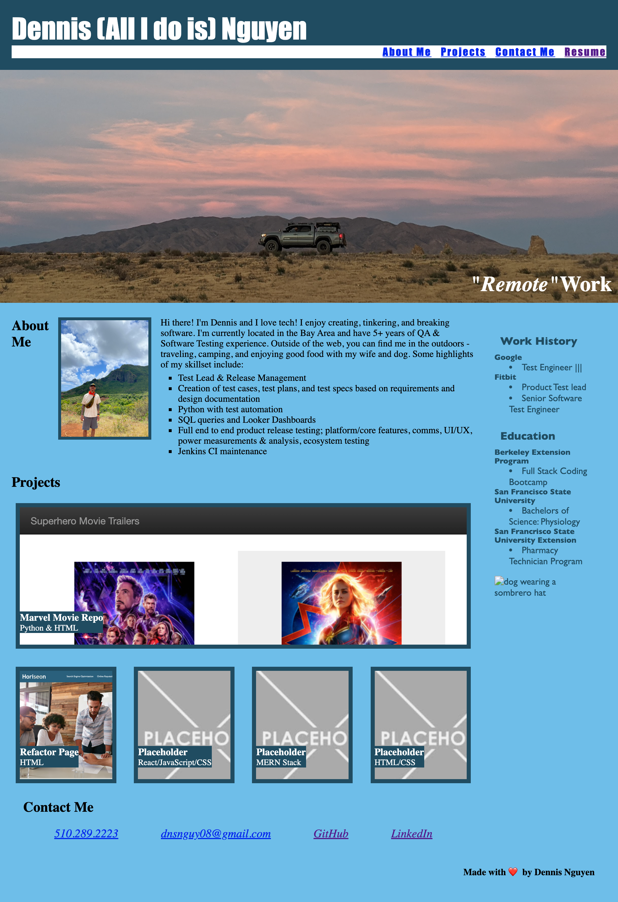

# Portfolio

## Table of contents

- [Overview](#overview)
  - [The challenge](#the-challenge)
  - [User Story](#user-story)
  - [Acceptance Criteria](#acceptance-criteria)
  - [Links](#links)
- [My process](#my-process)
  - [Built with](#built-with)
  - [What I learned](#what-i-learned)

## Overview

### The challenge

Build a portfolio page, which you can add to as the course progresses.

### User Story

AS AN employer
I WANT to view a potential employee's deployed portfolio of work samples
SO THAT I can review samples of their work and assess whether they're a good candidate for an open position

### Acceptance Criteria

GIVEN I need to sample a potential employee's previous work
WHEN I load their portfolio
THEN I am presented with the developer's name, a recent photo or avatar, and links to sections about them, their work, and how to contact them
WHEN I click one of the links in the navigation
THEN the UI scrolls to the corresponding section
WHEN I click on the link to the section about their work
THEN the UI scrolls to a section with titled images of the developer's applications
WHEN I am presented with the developer's first application
THEN that application's image should be larger in size than the others
WHEN I click on the images of the applications
THEN I am taken to that deployed application
WHEN I resize the page or view the site on various screens and devices
THEN I am presented with a responsive layout that adapts to my viewport

### Screenshot

### Links

- Solution URL: [https://github.com/dnsnguy08/html-css-1](https://github.com/dnsnguy08/portfolio)
- Live Site URL: [https://dnsnguy08.github.io/html-css-1/](https://dnsnguy08.github.io/portfolio/)

## My process

### Built with
- HTML
- CSS

### What I learned
It was great applying advanced CSS techniques and building a webpage from scratch. I'm already thinking of ways to improve on this portfolio and refactor the code.
